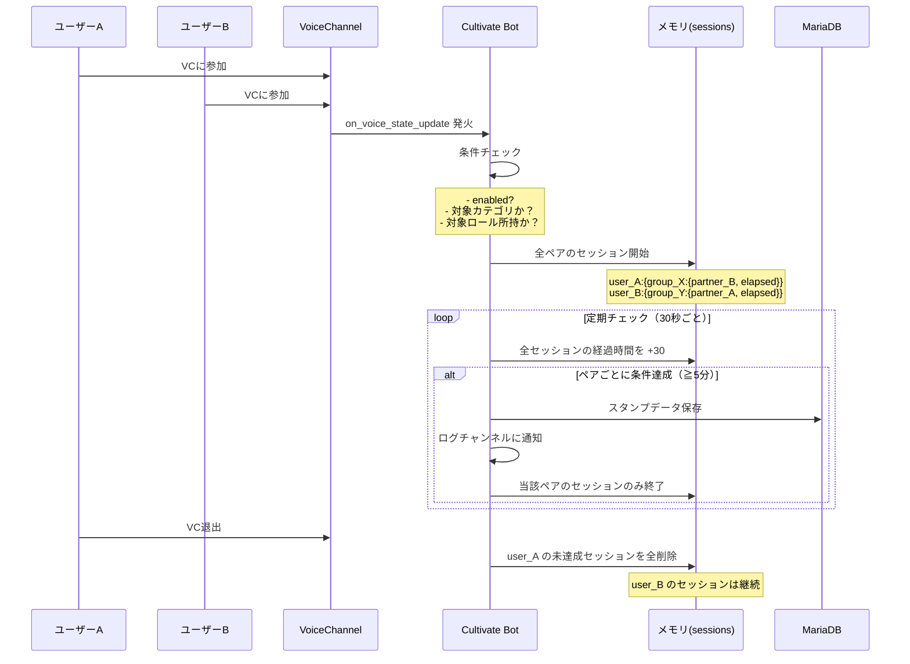

# 交流スタンプラリー機能 仕様書

> **作成日**: 2026-07-23
> **バージョン**: 1.0.0 (草案)
> **ステータス**: 依頼者レビュー待ち

---

## 1. 概要

### 1.1 機能の目的

16Fes内で実施する**交流スタンプラリー**用の機能です。
参加者が特定のロール（MBTIなど）を持つユーザーと指定VC内で一定時間以上交流すると、
そのロールグループに対応するスタンプを獲得します。

本機能は **MBTIに特化せず、任意のロールグループで汎用的に利用できる** 設計とします。
これにより、将来的にMBTI以外のスタンプラリー（例：部活動、趣味カテゴリなど）にも
転用可能です。

### 1.2 想定ユースケース

| ユースケース | 説明 |
|---|---|
| MBTIスタンプラリー | 16種類のMBTIタイプごとにスタンプを集める |
| 部活交流ラリー | 各部活動ロール所持者との交流を促す |
| 趣味カテゴリ交流 | 「ゲーム好き」「アニメ好き」などカテゴリ別 |

### 1.3 用語定義

| 用語 | 説明 |
|---|---|
| **スタンプグループ** | スタンプの種類を定義するグループ。MBTIなら「INFP」「ESTJ」など |
| **対象ロール** | スタンプグループに紐づくDiscordロール。例：INFP男性、INFP女性 |
| **スタンプ** | 特定のスタンプグループのロール所持者と交流完了した証 |
| **交流成立** | 対象VC内で、互いに対象ロールを所持する2名以上が指定時間以上同席すること |
| **スタンプカード** | ユーザーが獲得したスタンプ一覧を表示するカード |

---

## 2. 機能一覧

### 2.1 ユーザー向け機能

| No | 機能 | 説明 | 優先度 |
|---|---|---|---|
| U-01 | スタンプカード確認 | 自分の獲得スタンプ一覧を表示 | ★★★ |
| U-02 | スタンプ自動獲得 | VC交流で自動的にスタンプを獲得 | ★★★ |
| U-03 | 交流相手確認 | 各スタンプを誰との交流で獲得したか確認 | ★★☆ |
| U-04 | 達成率表示 | `3 / 16` のような達成率表示 | ★★☆ |
| U-05 | 進行中表示 | 現在交流中の相手と残り時間を表示（オプション） | ★☆☆ |

### 2.2 管理者向け機能

| No | 機能 | 説明 | 優先度 |
|---|---|---|---|
| A-01 | スタンプラリー設定 | 対象カテゴリ、スタンプグループ、必要交流時間を設定 | ★★★ |
| A-02 | ユーザースタンプ確認 | `/スタンプカード 確認 @user` で特定ユーザーの状況確認 | ★★★ |
| A-03 | スタンプ強制付与 | `/スタンプカード 追加 @user <グループ>` で手動付与 | ★★☆ |
| A-04 | スタンプ削除 | `/スタンプカード 削除 @user <グループ>` で削除 | ★★☆ |
| A-05 | スタンプリセット | `/スタンプカード リセット @user` で全スタンプリセット | ★★☆ |
| A-06 | 全体進捗確認 | サーバー全体のスタンプラリー統計表示 | ★☆☆ |

### 2.3 自動処理

| No | 機能 | 説明 | 優先度 |
|---|---|---|---|
| S-01 | VC入退室監視 | 対象カテゴリ内VCの入退室を検知 | ★★★ |
| S-02 | 交流時間計測 | 対象者同士の同席時間をカウント | ★★★ |
| S-03 | スタンプ自動付与 | 条件達成時にスタンプを自動付与 | ★★★ |
| S-04 | 獲得ログ出力 | 運営ログチャンネルへ獲得通知を送信 | ★★☆ |
| S-05 | コンプリート通知 | 全スタンプ達成時に特別通知 | ★★☆ |

---

## 3. 詳細仕様

### 3.1 参加条件

以下の**すべて**を満たすユーザーのみ計測対象とします：

1. スタンプラリーの**対象ロール**を1つ以上所持している
2. BOTではない
3. AFKチャンネルにいない

> **補足**: MBTIロール未所持者はスタンプラリーに参加できません（スタンプ獲得も不可）。

### 3.2 計測対象VC

- 運営が指定した**カテゴリー**内のVCのみ計測を行います
- カテゴリー外のVCは一切計測しません
- カテゴリーは管理者が自由に設定可能です

例：
```
📁 MBTI交流広場 (指定カテゴリ)
 ┣ ✅ MBTI新規開拓
 ┣ ✅ 新規開拓時限式
 ┣ ✅ 新規開拓
 ┣ ✅ フリル
📁 雑談 (非指定カテゴリ)
 ┣ ❌  general（計測されない）
```

### 3.3 スタンプ獲得条件

#### 基本条件（以下のすべてを満たした場合のみ計測開始）

| 条件 | 説明 |
|---|---|
| 対象カテゴリ内VC | 指定カテゴリ内のVCであること |
| VC人数2名以上 | 2名以上がVCに参加していること |
| 自身が対象ロール所持 | 計測対象者がいずれかの対象ロールを持つ |
| 相手が対象ロール所持 | 同席者のいずれかが対象ロールを持つ |
| BOTでない | 参加者全員がBOTでないこと |
| AFKでない | AFKチャンネルでのセッションでないこと |

#### 取得条件

- **対象スタンプグループのロール所持者と指定時間以上同席**
  - デフォルト: **5分（300秒）**
  - 時間は管理者が設定変更可能

#### スタンプ取得ルール

| ルール | 説明 |
|---|---|
| 1グループ1回のみ | 同じスタンプグループは1回しか取得できない |
| 重複取得不可 | 既に取得済みのグループは再計測しない |
| 複数同時進行可 | 複数の未取得グループと同時に交流可能（全ペア同時計測） |
| 自分自身は対象外 | 自分と同じスタンプグループのロールは対象外 |
| 切断でリセット | VCから退出したらそのグループの経過時間はリセット |
| ペアごとに独立計測 | 同席時間はユーザーペアごとに個別管理（片方だけ退出しても他方は継続） |

---

### 3.4 データ構造

#### 3.4.1 スタンプラリー設定（サーバー単位）

```json
{
  "guild_id": "123456789",
  "enabled": true,
  "target_category_ids": ["111", "222", "333"],
  "required_duration_seconds": 300,
  "stamp_groups": {
    "INFP": {
      "display_name": "INFP",
      "role_ids": ["444", "555"],
      "emoji": "🦋"
    },
    "ESTJ": {
      "display_name": "ESTJ",
      "role_ids": ["666", "777"],
      "emoji": "👔"
    }
  },
  "log_channel_id": "888",
  "notification": {
    "stamp_acquired": {
      "enabled": true,
      "channel_id": "888",
      "mention_user": false
    },
    "complete": {
      "enabled": true,
      "channel_id": "888",
      "message": "🏆 スタンプラリー完全制覇！"
    }
  },
  "complete_reward": {
    "notification_enabled": true,
    "role_reward_enabled": false,
    "reward_role_id": null
  },
  "stamp_card_image": {
    "enabled": true,
    "base_image_url": "https://example.com/card_base.png",
    "base_width": 800,
    "base_height": 600,
    "stamp_size": {
      "width": 80,
      "height": 80
    },
    "stamp_positions": {
      "INFP": {"x": 100, "y": 200},
      "ESTJ": {"x": 200, "y": 200}
    },
    "unacquired_image_url": "https://example.com/stamp_empty.png"
  }
}
```

> **画像生成について**: 各サーバーが台紙画像とスタンプ画像を用意し、
> スタンプごとの配置座標を設定します。未取得スタンプ用の空欄画像も設定可能です。
> 画像生成が不要な場合は `stamp_card_image.enabled = false` とすることで
> Embed表示のみに切り替えられます。

#### 3.4.2 ユーザースタンプデータ

```json
{
  "user_id": "123456789",
  "guild_id": "987654321",
  "stamps": {
    "INFP": {
      "partner_id": "111222333",
      "acquired_at": "2026-12-01T15:30:00"
    },
    "ENTP": {
      "partner_id": "444555666",
      "acquired_at": "2026-12-02T18:00:00"
    }
  }
}
```

#### 3.4.3 交流セッションデータ（メモリ上のみ）

> セッションは **チャンネル × ユーザー × スタンプグループ × 相手** の
> 4階層で管理。同席者全員分を同時に独立計測する。

```json
{
  "channel_111": {
    "user_123": {
      "INFP": {
        "partner_id": "456",
        "started_at": "2026-12-01T15:25:00",
        "elapsed_seconds": 240
      },
      "ENTP": {
        "partner_id": "789",
        "started_at": "2026-12-01T15:25:00",
        "elapsed_seconds": 240
      }
    },
    "user_456": {
      "ESTJ": {
        "partner_id": "123",
        "started_at": "2026-12-01T15:25:00",
        "elapsed_seconds": 240
      }
    }
  }
}
```

> 例: user_123 が INFPの456番とENTPの789番と同時に交流中。
> どちらかが退出しても、もう一方の計測は継続される。

### 3.5 保存データ項目

| 項目 | 型 | 説明 |
|---|---|---|
| `user_id` | str | DiscordユーザーID |
| `guild_id` | str | サーバーID |
| `stamps.<group>` | dict | 獲得済みスタンプ情報 |
| `stamps.<group>.partner_id` | str | 交流成立時の相手ユーザーID |
| `stamps.<group>.acquired_at` | datetime | スタンプ獲得日時 |

---

## 4. UI仕様

### 4.1 スタンプカード表示（ユーザー向け）

**起動方法**: ボタン または スラッシュコマンド `/スタンプカード`
> 両方実装し、サーバー設定でコマンドの有効/無効を切り替え可能。
> デフォルトはボタン表示を推奨。

**画像生成モード（有効時）**:
- サーバーが用意した台紙画像上に、取得済みスタンプを指定座標に合成
- 未取得スタンプは空欄画像または未取得画像を表示
- 生成された画像をEmbedに添付して表示

**Embed表示モード（画像生成無効時）**:

```
┌─────────────────────────────────────┐
│        🌟 交流スタンプラリー          │
│        ○○さんのスタンプカード         │
│                                     │
│  現在 3 / 16  達成率 18.8%          │
│  ████░░░░░░░░░░░░░░░░░░░░          │
│                                     │
│  ✅ INFP  🦋  (○○さんと交流)        │
│  ✅ ENTP  💡  (△△さんと交流)        │
│  ✅ ESTJ  👔  (□□さんと交流)        │
│  ❌ ISTJ  📋                        │
│  ❌ ISFJ  🛡️                        │
│  ...                                │
│                                     │
│         [ 🔄 更新 ]                  │
└─────────────────────────────────────┘
```

- 獲得済み: ✅ または専用スタンプ画像 + 相手名
- 未取得: ❌ または空欄画像
- 進捗バー: 視覚的に表示
- ボタンで更新可能

### 4.2 管理者向け確認

**コマンド**: `/スタンプカード 確認 @user`

```
┌─────────────────────────────────────┐
│  @user のスタンプラリー状況          │
│  達成率: 3/16 (18.8%)               │
│                                     │
│  ✅ INFP  相手: ○○  2026/12/01      │
│  ❌ ISTJ                            │
│  ❌ ISFJ                            │
│  ...                                │
└─────────────────────────────────────┘
```

### 4.3 スタンプ獲得ログ（運営チャンネル）

```
【スタンプ獲得】🎉
ユーザー：@user
獲得スタンプ：INFP 🦋
交流相手：@partner
達成数：7 / 16
```

> 本人への通知は**ログチャンネルが設定されていればON、未設定ならOFF**。

### 4.4 コンプリート通知

```
🏆 交流スタンプラリー完全制覇！
🎊 @user が全16タイプとの交流を達成しました！
```

> **設定項目**:
> - 通知のON/OFF
> - 通知先チャンネル
> - ロール付与のON/OFF（付与するロールも指定可能）
> - カスタムメッセージ
> - ロール付与は**設定すればON、未設定ならOFF**

---

## 5. コマンド一覧

### 5.1 ユーザーコマンド

| コマンド | 引数 | 説明 |
|---|---|---|
| `/スタンプカード` | なし | 自分のスタンプカードを表示（画像生成 or Embed） |

> **起動方法**: ボタンとスラッシュコマンドの両方を実装。
> サーバー設定でスラッシュコマンドの有効/無効を切り替え可能。

### 5.2 管理者コマンド

| コマンド | 引数 | 説明 | 権限 |
|---|---|---|---|
| `/スタンプカード 確認` | `user: ユーザー` | 指定ユーザーのスタンプ状況確認 | 管理者 |
| `/スタンプカード 追加` | `user: ユーザー, group: グループ名` | スタンプを手動付与 | 管理者 |
| `/スタンプカード 削除` | `user: ユーザー, group: グループ名` | スタンプを削除 | 管理者 |
| `/スタンプカード リセット` | `user: ユーザー` | 全スタンプをリセット | 管理者 |
| `/スタンプカード 設定` | なし | スタンプラリー設定パネルを開く | 管理者 |

> コマンド体系: 親コマンド `/スタンプカード` にサブコマンドで機能をグループ化。

---

## 6. 不正防止・制約

| No | 制約 | 説明 |
|---|---|---|
| 1 | BOT除外 | BOTアカウントは計測・対象から完全除外 |
| 2 | AFK除外 | AFKチャンネル在籍中は計測停止 |
| 3 | ロール未所持者除外 | 対象ロールを持たないユーザーは参加不可 |
| 4 | 指定カテゴリ外無効 | 設定されたカテゴリ外のVCは無効 |
| 5 | 重複取得不可 | 同一グループのスタンプは1回のみ |
| 6 | 自己除外 | 自分と同じグループのロールは相手として計測しない |
| 7 | 1名時停止 | VC人数が1名になったら全計測を停止 |
| 8 | 取得済みスキップ | 取得済みグループは再計測しない（負荷軽減） |
| 9 | 退出時リセット | VC退出で未達成の経過時間はリセット |

---

## 7. 技術設計方針

### 7.1 設計思想

- **MBTI非依存**: スタンプグループは任意に設定可能。MBTI以外の用途にも転用可能
- **システムコグとして実装**: `utils/system_cogs/` に配置し、移植性を高める
- **単一ファイル完結**: 全機能（コマンド・ボタンイベント・計測ロジック・DB操作・
  画像生成・テーブル作成）を `stamp_rally_cog.py` のみで完結。
  他ファイルへの分割は行わない
- **Cog内部でVC監視**: `on_voice_state_update` リスナーを Cog 内に直接実装。
  `voice_state_update_event.py` の変更は不要
- **Cog初期化時にDBセットアップ**: `cog_load()` 内でテーブル作成を実行。
  `database.py` の `init()` への追加も不要
- **自動ロード**: `cultivate_main.py` は `utils/system_cogs/` 内の全 `.py` を
  自動検出してロードするため、手動での cog 登録追加は不要
- **計測ロジックはバックグラウンドタスク**: `discord.ext.tasks` で定期チェック（30秒間隔）

### 7.2 想定ファイル構成

```
utils/system_cogs/
  stamp_rally_cog.py          # ★全機能をこの1ファイルに集約
                              #   - コマンド定義（ユーザー/管理者）
                              #   - ボタンイベントハンドラ
                              #   - on_voice_state_update リスナー（VC入退室監視）
                              #   - 計測ロジック・セッション管理
                              #   - スタンプ付与・通知
                              #   - スタンプカード画像生成
                              #   - DBテーブル作成（cog_load時）
                              #   - DB CRUD操作（すべて内部で完結）

# 以下のファイルへの変更は一切不要
# database.py                 ← 変更なし
# cultivate_main.py           ← 変更なし（自動検出により自動ロード）
# events/voice_state_update_event.py ← 変更なし
```

> **設計理由**: システムコグの設計思想「そのモジュールのみで完結し、
> 他Botにそのまま移植すれば機能が使える」に完全準拠。
> `stamp_rally_cog.py` をコピーするだけで、どのBotでも交流スタンプラリー機能が
> 即座に利用可能となる。

### 7.3 データベース設計

**テーブル1: `stamp_rally_config`**（サーバー設定）

| カラム | 型 | 説明 |
|---|---|---|
| id | INT | 主キー |
| guild_id | VARCHAR(255) | サーバーID (UNIQUE) |
| setting_json | JSON | 設定データ（3.4.1参照） |

**テーブル2: `stamp_rally_user_data`**（ユーザーデータ）

| カラム | 型 | 説明 |
|---|---|---|
| id | INT | 主キー |
| guild_id | VARCHAR(255) | サーバーID |
| user_id | VARCHAR(255) | ユーザーID |
| stamp_data_json | JSON | スタンプデータ（3.4.2参照） |

> UNIQUE KEY: `(guild_id, user_id)`

### 7.4 計測ロジックの流れ



### 7.5 パフォーマンス考慮

- 計測は**30秒間隔**のバックグラウンドループで実行
- 取得済みグループは計測対象から除外（DBアクセス削減）
- セッションデータは**メモリ上（dict）**で管理し、DB負荷を最小化
- VC人数が1名になったチャンネルはセッションを全削除
- ペア数が増えても dict のキー走査のみで O(n) の軽量処理
- 画像生成はリクエスト時のみ実行（Pillowを同期的に使用）

---

## 8. 決定事項（全項目確認済み ✅）

2026-07-23 に依頼者と全項目を合意。

| No | 項目 | 決定内容 |
|---|---|---|
| Q1 | スタンプカードの画像生成 | **画像生成する**。台紙とスタンプ画像は**運営側で用意**。座標指定で配置。Pillow(PIL)を使用 |
| Q2 | 交流時間のデフォルト値 | **5分（300秒）**。管理者が設定変更可能 |
| Q3 | 途中経過の通知 | **デフォルトは通知なし**。設定でON/OFF・通知方式（DM/チャンネル）を切替可能。スタンプカード確認パネルで現状把握も可能 |
| Q4 | スタンプカード起動方法 | **ボタン + コマンド両方実装**。サーバー設定でコマンドの有効/無効を切替可能 |
| Q5 | コンプリート特典 | **通知・ロール付与を設定からON/OFF可能**。ロール付与は設定時ON、未設定時OFF |
| Q6 | 機能の有効/無効 | **設定プリセットに `enabled` フラグを追加**。サーバー単位でON/OFF可能 |
| Q7 | 同時交流のカウント方法 | **同席者全員分を同時計測**。ペアごとに経過時間を個別管理（片方退出でも他方は継続） |
| — | スタンプ獲得時の本人通知 | **ログチャンネル設定時はON、未設定時はOFF** |
| — | コンプリート特典ロール付与 | **設定時はON、未設定時はOFF** |

---

## 9. スケジュール感（目安）

| フェーズ | 内容 | 目安工数 |
|---|---|---|
| 1. 設計 | DB設計、API設計、詳細設計 | 0.5日 |
| 2. DB実装 | テーブル作成、DB関数実装 | 0.5日 |
| 3. コアロジック | 計測・セッション管理・スタンプ付与 | 1.5日 |
| 4. コマンド実装 | ユーザー/管理者コマンド | 1日 |
| 5. UI実装 | スタンプカードEmbed、ボタン | 0.5日 |
| 6. テスト | 動作確認・デバッグ | 1日 |
| **合計** | | **約5日** |
